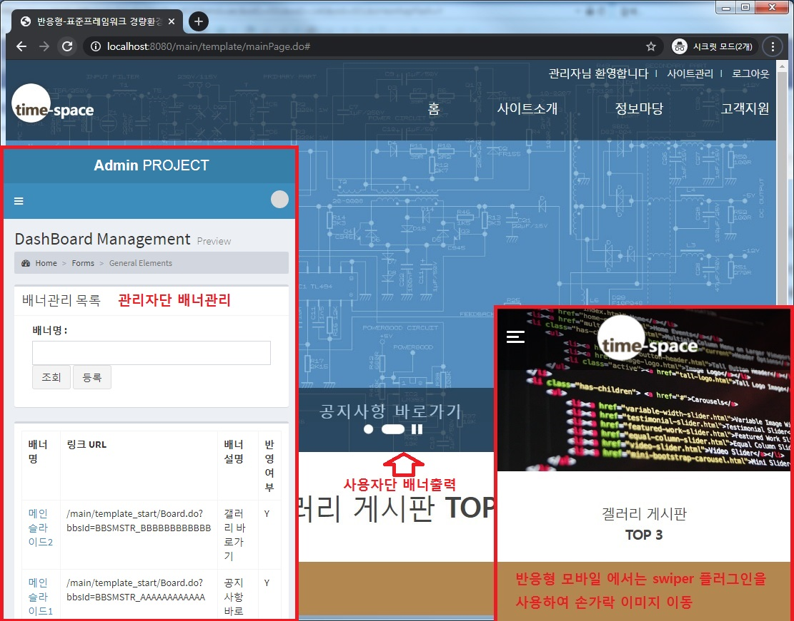
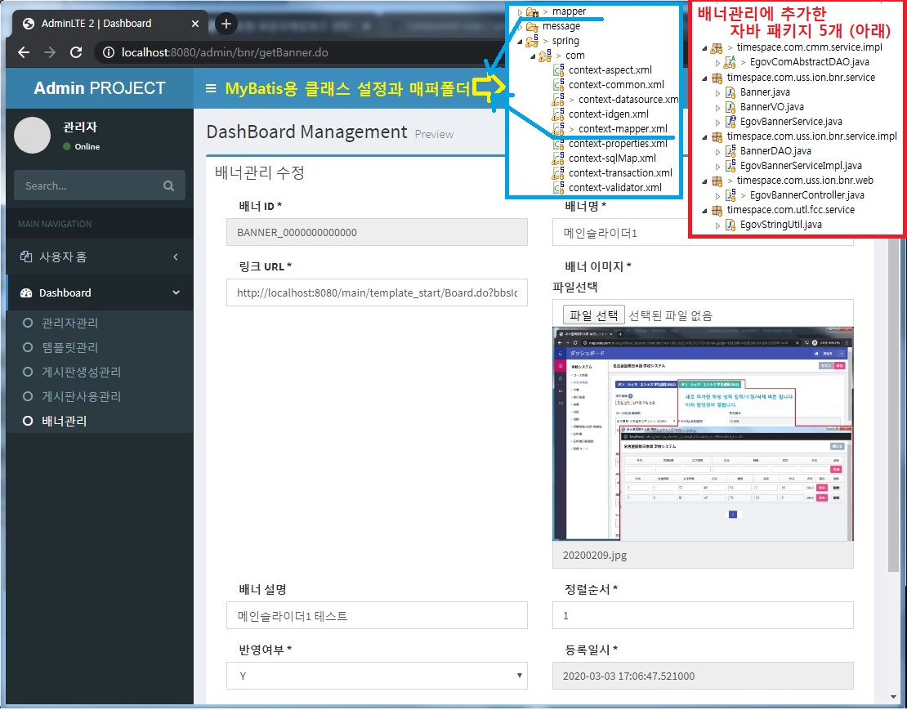
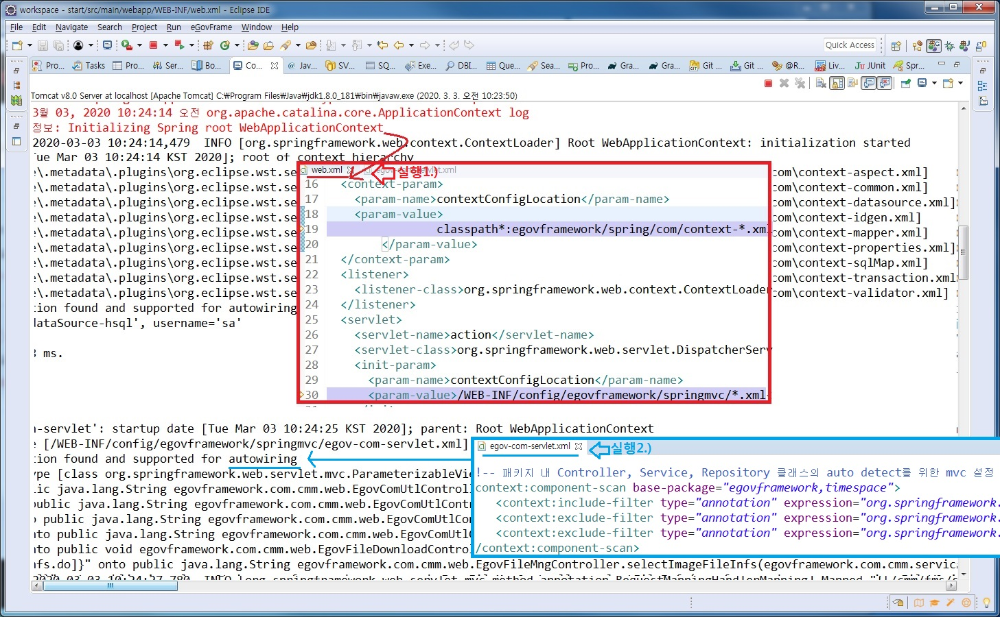
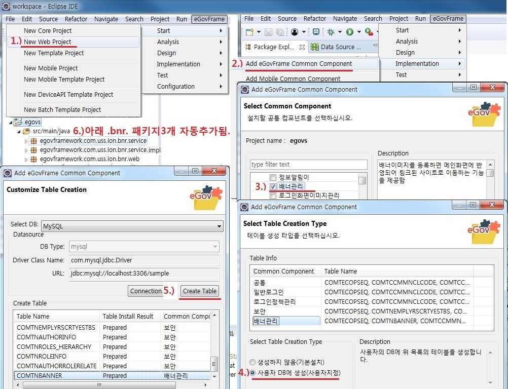

## 전자정부표준프레임웍(이하 egov로 표기)<br> 심플홈템플릿(이하 sht로 표기)을 이용한 CMS 만들기
***
전자정부 표준프레임워크 라이선스는 Apache 2.0 라이선스를 따릅니다.부트스트랩/AdminLTE/기타등등<br>
표준프레임워크 내에서 사용된 외부 오픈소스의 경우 원 오픈소스의 라이선스 정책을 유지합니다.
[라이센스 보기](https://www.egovframe.go.kr/EgovLicense.jsp)
***
>작업일자(아래): 20200304
### 기존 cms프로젝트(ibatis용)에서 배너관리기능(mybatis용) 사용자단 출력기능 추가OK.
- 배너 사용자단 출력기능 작업 결과.

- 슬라이드 자바스크립트에서 링크부분 핵심.
```javascript
...
$(".viewImgList li.imglist1").css({'z-index' : '10' });
$(".viewImgList li.imglist2").css({'z-index' : '10' });
$(".viewImgList li.imglist0").css({'z-index' : '50' });
...
```
- 모바일용 배너 핵심코드(아래).
```html
...
<script src="<c:url value='/'/>resources/template_start/js/swiper.min.js"></script>
<script>var swiper = new Swiper('.swiper-container');</script>
...
```

>작업일자(아래): 20200303
### 기존 cms프로젝트(ibatis용)에서 배너관리기능(mybatis용) 관리자단 추가OK.
- 관리자 배너관리기능 작업 결과.

- 배너 첨부파일 핵심1. egov개발환경3.9로 추가한 기능은 COMTNFILEDETAIL 테이블을 사용하지만,
- CMS와 합칠때, 기존 LETTNFILEDETAIL 테이블을 이용하도록 xml쿼리 변경.
- 참고: 스프링 웹앱이 실행되는 순서 기술정보: https://hamait.tistory.com/322

- 다음작업예정. 배너 사용자단 출력기능 추가.

>작업일자(아래): 20200302
### 기존 cms프로젝트(ibatis용)에서 배너관리기능(mybatis용)을 추가 하기위해, ibatis와 mybatis 동시지원처리.
- egov개발환경 3.9버전사용(실행환경은 v3.8) 
- 동시지원 작업전 기술정보: https://dydals5678.tistory.com/84
- ibatis와 mybatis 동시지원 핵심1. src/main/resources/egovframework/spring/com/context-mapper.xml 추가. 
- ibatis와 mybatis 동시지원 핵심2. src/main/resources/egovframework/mapper 폴더 추가.
- 관리자 배너관리기능 작업중.
- 배너기능 작업전 기술정보: https://www.egovframe.go.kr/wiki/doku.php?id=egovframework:com:v2:uss:%EB%B0%B0%EB%84%88%EA%B4%80%EB%A6%AC 
### [ScreenShot 아래 1)번 부터 ~ 6)번 까지 실행했음.]<br>

- 다음작업예정. 배너관리기능 마무리.

>작업일자(아래): 20200226
### 기존 sht프로젝트 로깅기능은 그대로 두고, context-aspect.xml파일에 실시간 실행클래스와 매서드도 표시 되도록 추가.
```xml
<!-- AOP Aspect로깅 처리 기능 추가: KIK -->
	<bean id="loggingAspect" class="timespace.miniplugin.com.LoggingAspect"/>
 	<aop:config>
	 	<aop:pointcut id="getLogging" expression="execution(* egovframework.let..impl.*Impl.*(..)) or execution(* egovframework.com..impl.*Impl.*(..)) or execution(* timespace.let..impl.*Impl.*(..)) or execution(* timespace.com..impl.*Impl.*(..)) or execution(* timespace.miniplugin..impl.*Impl.*(..))" />
 		<aop:aspect ref="loggingAspect">
 			<aop:before method="logBefore" pointcut-ref="getLogging"/>
 			<aop:after method="logAfter" pointcut-ref="getLogging"/>
 			<!-- 
 			<aop:before method="logBeforeUpdate" pointcut-ref="updateLogging"/>
 			<aop:after-returning method="logAfterReturning" pointcut-ref="getLogging"/>
 			<aop:after-throwing method="logAfterThrowing" pointcut-ref="getLogging"/>
 			<aop:around method="logAround" pointcut-ref="saveLogging"/>
 			 -->
 		</aop:aspect>
 	</aop:config>
```
- timespace.miniplugin.com 패키지에 AOP로 구현된 LoggingAspect.java 클래스 추가.  

>작업일자(아래): 20200225
### 기존 sht프로젝트 패키지명 egov..시작은 그대로 두고, 신규 패키지는 timespace..으로 시작.
- egov-com-servlet.xml 연동점검1. 때문에 추가

```xml
<mvc:interceptor>
    <mvc:mapping path="/cop/com/*.do"/>
    <mvc:mapping path="/cop/bbs/*Master*.do"/>
    <mvc:mapping path="/uat/uia/*.do"/>
    <mvc:mapping path="/uss/umt/mber/*.do"/>
    <mvc:exclude-mapping path="/uat/uia/actionLogin.do"/>
    <mvc:exclude-mapping path="/uat/uia/egovLoginUsr.do"/>
    <!-- 연동 SW 점검 1. 때문에 추가 -->
    <mvc:exclude-mapping path="/egovSampleList.do"/>
    <mvc:exclude-mapping path="/addSample.do"/>
    <mvc:exclude-mapping path="/updateSample.do"/>
    <mvc:exclude-mapping path="/deleteSample.do"/>
    
    <bean class="egovframework.com.cmm.interceptor.AuthenticInterceptor" />
</mvc:interceptor>
```

>작업일자(아래): 20200215
### 사이트관리(관리자) 에서  템플릿 관리를 이용해서 사이트 템플릿 관리 기능 추가.
- index.jsp파일 수정
```javascript
<script type="text/javaScript">document.location.href="<c:url value='/home.do'/>"</script>
```
- 메인 페이지에서 템플릿 화면으로 연계하는 컨트롤러 추가
```java
@RequestMapping(value = "/home.do")
	public String forwardPageWithTemplate(HttpServletRequest request, ModelMap model)
	  throws Exception{
		// 사이트 템플릿 지정 시작 LETTNTMPLATINFO > TMPLAT_ID[TMPLAT_SITE_DEFAULT]
		String returnUrl = "/main/template/mainPage.do";//초기 템플릿
		TemplateInfVO siteTmplatInfVO = new TemplateInfVO();
		siteTmplatInfVO.setTmplatSeCode("TMPT02");
		//siteTmplatInfVO.setTypeFlag("SITE");
		Map<String, Object> sitemap = tmplatService.selectTemplateInfs(siteTmplatInfVO);
		if(sitemap != null) {
			List<TemplateInfVO> mapList = (List<TemplateInfVO>) sitemap.get("resultList");
			//System.out.println(sitemap.get("resultList"));//디버그
			for(TemplateInfVO templateInfVO : mapList) {
				//System.out.println(templateInfVO.getTmplatId());
				//System.out.println(templateInfVO.getTmplatSeCode());
				//System.out.println(templateInfVO.getUseAt());
				//System.out.println(templateInfVO.getTmplatCours());
				if(templateInfVO.getTmplatSeCode().equals("TMPT02") && templateInfVO.getUseAt().equals("Y")) {
					returnUrl = templateInfVO.getTmplatCours();
				}
			}
	    }
		System.out.println("템플릿 URL: " + returnUrl);
		return "redirect:"+returnUrl; // main/template/mainPage.do || cmm/main/mainPage.do
		// 사이트 템플릿 지정 끝
	}
```

>작업일자(아래): 20200214
### 게시판에 웹에디터 적용.
- 기존 depends="required" 값제거 src/main/resources/egovframework/validator/com/cop/bbs/EgovNoticeRegist.xml 파일
- 그 외 다른 제약조건 확인: src/main/resources/egovframework/spring/com/context-validator.xml 파일

>작업일자(아래): 20200213
### 게시판 관리중 게시판 템플릿관리 CRUD 적용.
- 게시판템플릿관리-> 템플릿관리(게시판템플릿|사이트템플릿)로 분리.

>작업일자(아래): 20200212
### HsqlDb일때 Select쿼리 preparation구문에서 쿼리문제 발생 처리.
- 원인은 Hsqldb에서다중쿼리를 날릴때 문제가 아님.
- EgovMberManage_SQL_Hsql.xml 쿼리 수정 후 정상 작동OK.
- 관리자메뉴 Active 표시 핵심 코드. <c:import url="/EgovPageLink.do?link=admin/include/header" />

>작업일자(아래): 20200211
### 게시판 관리중 게시판 사용관리 CRUD 적용.

>작업일자(아래): 20200210
### 게시판 관리중 게시판 생성관리 CRUD 적용

>작업일자(아래): 20200207
### 사이트관리(관리자) 관리자 관리 프로그램 적용

>작업일자(아래): 20200206
### 사이트관리(관리자) 페이지 분리 후 문제 발생 처리
- 관리자관리 기능 추가에 따른 EgovMberManage_SQL_Hsql.xml 추가.
- Hsql, Mysql 2개 같이 호환 않되는 문제가 있어서 초기 파일 EgovMberManage.jsp 수정.
- HsqlDb일때 Select쿼리 preparation구문에서 아래와 같은 쿼리문제 발생(Update, Insert는 정상).
- Hsql 에러메시지(Mysql은 정상): SQL Statement (preparation failed) unexpected token: ?.
- Select, Update, Insert는 문제없고, MysqlDb일때는 문제 없음. 그래서, 확인만 하고 넘어감.
- Hsql 더미데이터: shtdb.sql , Mysql 더미데이터: sht20200206.sql 수정.

>작업일자(아래): 20200205
### 사이트관리(관리자) 페이지 로그인 부분 분리 후 적용(Admin LTE 공개 플러그인 적용)
- egov-com-servlet.xml 파일에 admin 하위 페이지 접속 제한 및 관리자 로그인 경로 사용자와 분리.
- admin 폴더 생성 후 기본 디자인 파일 생성.
- admin/home.do = MainView.jsp 와 LoginUsr.jsp 프로그램 적용.

>작업일자(아래): 20200204
### 기존 심플템플릿과 신규 템플릿 분리 
- [공통]egov3.8개발환경 심플템플릿 기반.
- /src/main/wepapp/resources 추가 후 template_start 추가.
- WEB-INF/jsp/main/template_start 추가.
- 기존 소스 변경한 파일2개: 1).홈페이지 초기화면 EgovMainView.jsp 수정. 기존백업 EgovMainView_org.jsp
- 2).WEB-INF/jsp/cmm/uat/uia/EgovLoginUsr.jsp 수정. 기존백업  EgovLoginUsr_org.jsp

>작업일자(아래): 20200203
### 갤러리 자료실 답글 CRUD프로그램 적용 및 입력/수정후 페이지 새로고침시 데이터중복등록되는 문제 처리
>작업일자(아래): 20200202
### 고객지원 반응형 디자인에 갤러리 자료실 CRUD프로그램 적용
>작업일자(아래): 20200201
### 고객지원 서비스신청 및 갤러리 자료실 리스트/상세뷰/입력 화면 반응형으로 변경
>작업일자(아래): 20200130
### 정보마당, 로그인페이지 반응형으로 변경
>작업일자(아래): 20200129
### 반응형(모바일)에서 2차메뉴 보이기 추가 common_bottom.jsp 에 자바스크립트 추가
>작업일자(아래): 20200128
### egov-sht 프로젝트 Mysql을 Hsql로 변환
- egov3.8개발환경에서는 초기 sht프로젝트는 HsqlDb를 사용합니다.
- 실제 상용 서비스에서는 Mysql을 사용하기 때문에, Mysql로 변경하고, 관리자 기능-관리자등록/삭제 을 추가하였습니다.
- 이번에 View 부분을 반응형으로 바꾸기 위해서, 임시로 HsqlDb로 다시 변경 하였습니다.
- 변경한 파일3개: pom.xml, globals.properties, context-datasource.xml

#### Mysql 일때와 Hsql 일대 스키마 차이는 아래와 같습니다(나머지 테이블 17개는 동일함).
DB구분 | 테이블명 | 확인쿼리
---|:---:|:---
`Mysql용` | comtecopseq / comvnusermaster | `SELECT * FROM comtecopseq;`
`Hsql용` | LETTHEMPLYRINFOCHANGEDTLS / LETTNAUTHORINFO / LETTNEMPLYRSCRTYESTBS | `SELECT * FROM LETTNAUTHORINFO;`
